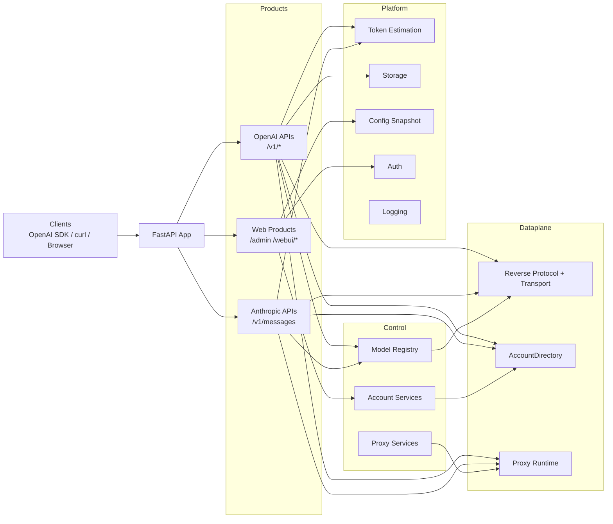



[](https://www.python.org/)
[](https://fastapi.tiangolo.com/)
[](pyproject.toml)
[](LICENSE)
[](docs/README.en.md)
[](https://deepwiki.com/jiujiu532/grok2api)
[](https://blog.cheny.me/blog/posts/grok2api)


> [!NOTE]
> 鏈」鐩粎渚涘涔犱笌鐮旂┒浜ゆ祦銆傝鍔″繀閬靛惊 Grok 鐨勪娇鐢ㄦ潯娆惧強褰撳湴娉曞緥娉曡锛屼笉寰楃敤浜庨潪娉曠敤閫旓紒浜屽紑涓?PR 璇蜂繚鐣欏師浣滆€呬笌鍓嶇鏍囪瘑銆?
<br>

Grok2API 鏄竴涓熀浜?**FastAPI** 鏋勫缓鐨?Grok 缃戝叧锛屾敮鎸佸皢 Grok Web 鑳藉姏浠?OpenAI 鍏煎 API 鐨勬柟寮忚浆鎹€傛牳蹇冪壒鎬э細
- OpenAI 鍏煎鎺ュ彛锛歚/v1/models`銆乣/v1/chat/completions`銆乣/v1/responses`銆乣/v1/images/generations`銆乣/v1/images/edits`銆乣/v1/videos`銆乣/v1/videos/{video_id}`銆乣/v1/videos/{video_id}/content`
- Anthropic 鍏煎鎺ュ彛锛歚/v1/messages`
- 鏀寔娴佸紡涓庨潪娴佸紡瀵硅瘽銆佹樉寮忔€濊€冭緭鍑恒€佸嚱鏁板伐鍏风粨鏋勯€忎紶锛屼互鍙婄粺涓€鐨?token / usage 缁熻
- 鏀寔澶氳处鍙锋睜銆佸眰绾ч€夊彿銆佸け璐ュ弽棣堛€侀搴﹀悓姝ヤ笌鑷姩缁存姢
- 鏀寔鏈湴缂撳瓨鍥剧墖銆佽棰戜笌鏈湴浠ｇ悊閾炬帴杩斿洖
- 鏀寔鏂囩敓鍥俱€佸浘鍍忕紪杈戙€佹枃鐢熻棰戙€佸浘鐢熻棰?- 鍐呯疆 Admin 鍚庡彴绠＄悊銆乄eb Chat銆丮asonry 鐢熷浘銆丆hatKit 璇煶椤甸潰

<br>

## 鏈嶅姟鏋舵瀯



<br>

## 蹇€熷紑濮?
### 鏈湴閮ㄧ讲锛堟帹鑽愶級

**鍓嶇疆瑕佹眰**锛歅ython 3.13+锛孾uv](https://docs.astral.sh/uv/getting-started/installation/) 鍖呯鐞嗗櫒

```bash
git clone https://github.com/jiujiu532/grok2api
cd grok2api/grok2api-main/grok2api-main
cp .env.example .env
uv sync
uv run granian --interface asgi --host 0.0.0.0 --port 8000 --workers 1 app.main:app
```

鏈嶅姟鍚姩鍚庤闂?`http://localhost:8000/admin/login` 杩涜鍒濆鍖栭厤缃€?
### Docker Compose 閮ㄧ讲

**鍓嶇疆瑕佹眰**锛欴ocker & Docker Compose

```bash
git clone https://github.com/jiujiu532/grok2api
cd grok2api/grok2api-main/grok2api-main
cp .env.example .env
docker compose up -d
```

鏌ョ湅鏃ュ織锛?```bash
docker compose logs -f grok2api
```

### Docker 鍗曞鍣ㄩ儴缃?
```bash
docker run -d \
  --name grok2api \
  -p 8000:8000 \
  -e LOG_LEVEL=INFO \
  -e ACCOUNT_STORAGE=local \
  -v grok2api_data:/app/data \
  -v grok2api_logs:/app/logs \
  ghcr.io/jiujiu532/grok2api:latest
```

### Vercel 閮ㄧ讲

[](https://vercel.com/new/clone?repository-url=https://github.com/jiujiu532/grok2api&env=LOG_LEVEL,LOG_FILE_ENABLED,DATA_DIR,LOG_DIR,ACCOUNT_STORAGE,ACCOUNT_REDIS_URL,ACCOUNT_MYSQL_URL,ACCOUNT_POSTGRESQL_URL)

### Render 閮ㄧ讲

[](https://render.com/deploy?repo=https://github.com/jiujiu532/grok2api)

### 鍒濆鍖栭厤缃?
閮ㄧ讲瀹屾垚鍚庯紝璁块棶 Admin 鍚庡彴杩涜浠ヤ笅閰嶇疆锛?
1. **淇敼 `app.app_key`**锛圓dmin 鍚庡彴鐧诲綍瀵嗛挜锛岄粯璁?`grok2api`锛?2. **璁剧疆 `app.api_key`**锛圓PI 璋冪敤閴存潈瀵嗛挜锛屼负绌哄垯涓嶉壌鏉冿級
3. **璁剧疆 `app.app_url`**锛堟湇鍔″缃戝湴鍧€锛岀敤浜庡浘鐗囥€佽棰戦摼鎺ヨ繑鍥烇紝鍚﹀垯浼?403锛?
> 馃挕 **鎻愮ず**锛氶娆″惎鍔ㄦ椂浼氳嚜鍔ㄧ敓鎴?`${DATA_DIR}/config.toml`锛屽彲鍦?Admin 鍚庡彴瀹炴椂淇敼閰嶇疆銆?
<br>

## WebUI

### 椤甸潰鍏ュ彛

| 椤甸潰 | 璺緞 |
| :-- | :-- |
| Admin 鐧诲綍椤?| `/admin/login` |
| 璐﹀彿绠＄悊 | `/admin/account` |
| 閰嶇疆绠＄悊 | `/admin/config` |
| 缂撳瓨绠＄悊 | `/admin/cache` |
| WebUI 鐧诲綍椤?| `/webui/login` |
| Web Chat | `/webui/chat` |
| Masonry | `/webui/masonry` |
| ChatKit | `/webui/chatkit` |

### 閴存潈瑙勫垯

| 鑼冨洿 | 閰嶇疆椤?| 瑙勫垯 |
| :-- | :-- | :-- |
| `/v1/*` | `app.api_key` | 涓虹┖鍒欎笉棰濆閴存潈 |
| `/admin/*` | `app.app_key` | 榛樿鍊?`grok2api` |
| `/webui/*` | `app.webui_enabled`, `app.webui_key` | 榛樿鍏抽棴锛沗webui_key` 涓虹┖鍒欎笉棰濆鏍￠獙 |

<br>

## 璐﹀彿绠＄悊

### 璐﹀彿绫诲瀷

| 绫诲瀷 | 璇存槑 | 鏀寔妯″瀷 |
| :-- | :-- | :-- |
| **浠樿垂璐﹀彿** | X.AI 瀹樻柟浠樿垂璐﹀彿 | 鎵€鏈?`grok-4.20-*` 鍜?`grok-4.3-beta` 妯″瀷 |
| **鍏嶈垂璐﹀彿** | 閫氳繃 console.x.ai 璁块棶鐨勫厤璐硅处鍙?| 鎵€鏈?`*-console` 妯″瀷 |

### 鍏嶈垂璐﹀彿閰嶇疆

浣跨敤鍏嶈垂璐﹀彿闇€瑕侀厤缃?SSO Token 鍜?CF Clearance锛?
1. 鎵撳紑娴忚鍣ㄥ紑鍙戣€呭伐鍏凤紙F12锛?2. 璁块棶 `https://console.x.ai/`
3. 鍦?Network 鏍囩涓壘鍒颁换鎰忚姹傦紝鏌ョ湅 Cookie锛?   - 澶嶅埗 `sso` 鍊?   - 澶嶅埗 `cf_clearance` 鍊?4. 鍦?Admin 鍚庡彴娣诲姞璐﹀彿鏃讹紝灏嗚繖涓や釜鍊煎～鍏ュ搴斿瓧娈?
> 鈿狅笍 **瀹夊叏鎻愮ず**锛歋SO Token 鍜?CF Clearance 鏄晱鎰熶俊鎭紝璇峰嬁鍦ㄤ唬鐮佷腑纭紪鐮佹垨鎻愪氦鍒扮増鏈帶鍒躲€傚缓璁€氳繃鐜鍙橀噺鎴栧瘑閽ョ鐞嗙郴缁熶紶鍏ャ€?
<br>

## 閰嶇疆浣撶郴

### 閰嶇疆鍒嗗眰

| 浣嶇疆 | 鐢ㄩ€?| 鐢熸晥鏃舵満 |
| :-- | :-- | :-- |
| `.env` | 鍚姩鍓嶉厤缃?| 鏈嶅姟鍚姩鏃?|
| `${DATA_DIR}/config.toml` | 杩愯鏃堕厤缃?| 淇濆瓨鍚庡嵆鏃剁敓鏁?|
| `config.defaults.toml` | 榛樿妯℃澘 | 棣栨鍒濆鍖栨椂 |


### 鐜鍙橀噺

| 鍙橀噺鍚?| 璇存槑 | 榛樿鍊?|
| :-- | :-- | :-- |
| `TZ` | 鏃跺尯 | `Asia/Shanghai` |
| `LOG_LEVEL` | 鏃ュ織绾у埆 | `INFO` |
| `LOG_FILE_ENABLED` | 鍐欏叆鏈湴鏂囦欢鏃ュ織 | `true` |
| `ACCOUNT_SYNC_INTERVAL` | 璐﹀彿鐩綍澧為噺鍚屾闂撮殧锛堢锛?| `30` |
| `ACCOUNT_SYNC_ACTIVE_INTERVAL` | 璐﹀彿鐩綍妫€娴嬪埌鍙樺寲鍚庣殑娲昏穬鍚屾闂撮殧锛堢锛?| `3` |
| `SERVER_HOST` | 鏈嶅姟鐩戝惉鍦板潃 | `0.0.0.0` |
| `SERVER_PORT` | 鏈嶅姟鐩戝惉绔彛 | `8000` |
| `SERVER_WORKERS` | Granian worker 鏁伴噺 | `1` |
| `HOST_PORT` | Docker Compose 瀹夸富鏈烘槧灏勭鍙?| `8000` |
| `DATA_DIR` | 鏈湴鏁版嵁鏍圭洰褰曪紙璐﹀彿搴撱€佹湰鍦板獟浣撴枃浠躲€佺紦瀛樼储寮曠粺涓€浣嶄簬姝ょ洰褰曚笅锛?| `./data` |
| `LOG_DIR` | 鏈湴鏃ュ織鐩綍 | `./logs` |
| `ACCOUNT_STORAGE` | 璐﹀彿瀛樺偍鍚庣 | `local` |
| `ACCOUNT_LOCAL_PATH` | `local` 妯″紡璐﹀彿 SQLite 璺緞 | `${DATA_DIR}/accounts.db` |
| `ACCOUNT_REDIS_URL` | `redis` 妯″紡 Redis DSN | `""` |
| `ACCOUNT_MYSQL_URL` | `mysql` 妯″紡 SQLAlchemy DSN | `""` |
| `ACCOUNT_POSTGRESQL_URL` | `postgresql` 妯″紡 SQLAlchemy DSN | `""` |
| `ACCOUNT_SQL_POOL_SIZE` | SQL 杩炴帴姹犳牳蹇冭繛鎺ユ暟 | `5` |
| `ACCOUNT_SQL_MAX_OVERFLOW` | SQL 杩炴帴姹犳渶澶ф孩鍑鸿繛鎺ユ暟 | `10` |
| `ACCOUNT_SQL_POOL_TIMEOUT` | 绛夊緟杩炴帴姹犵┖闂茶繛鎺ョ殑瓒呮椂鏃堕棿锛堢锛?| `30` |
| `ACCOUNT_SQL_POOL_RECYCLE` | 杩炴帴鏈€澶у鐢ㄦ椂闂达紙绉掞級锛岃秴鏃跺悗鑷姩閲嶈繛 | `1800` |
| `CONFIG_LOCAL_PATH` | `local` 妯″紡杩愯鏃堕厤缃枃浠惰矾寰?| `${DATA_DIR}/config.toml` |

> 馃挕 **console.x.ai 鍏嶈垂璐﹀彿**锛氬浣跨敤鍏嶈垂璐﹀彿锛岄渶鍦?Admin 鍚庡彴娣诲姞璐﹀彿鏃舵彁渚?SSO Token 鍜?CF Clearance Cookie銆傝繖浜涘€间細琚畨鍏ㄥ瓨鍌紝涓嶄細鍦ㄦ棩蹇楁垨鍝嶅簲涓毚闇层€?
杩愯鏃堕厤缃篃鏀寔 `GROK_` 鍓嶇紑鐜鍙橀噺瑕嗙洊锛屼緥濡?`GROK_APP_API_KEY` 浼氳鐩?`app.api_key`锛宍GROK_FEATURES_STREAM` 浼氳鐩?`features.stream`銆?
### 绯荤粺閰嶇疆椤?
| 鍒嗙粍 | 鍏抽敭椤?|
| :-- | :-- |
| `app` | `app_key`, `app_url`, `api_key`, `webui_enabled`, `webui_key` |
| `logging` | `file_level`, `max_files` |
| `features` | `temporary`, `memory`, `stream`, `thinking`, `auto_chat_mode_fallback`, `thinking_summary`, `dynamic_statsig`, `enable_nsfw`, `show_search_sources`, `custom_instruction`, `image_format`, `imagine_public_image_proxy`, `video_format` |
| `proxy.egress` | `mode`, `proxy_url`, `proxy_pool`, `resource_proxy_url`, `resource_proxy_pool`, `skip_ssl_verify` |
| `proxy.clearance` | `mode`, `cf_cookies`, `user_agent`, `browser`, `flaresolverr_url`, `timeout_sec`, `refresh_interval` |
| `retry` | `reset_session_status_codes`, `max_retries`, `on_codes` |
| `account.refresh` | `basic_interval_sec`, `super_interval_sec`, `heavy_interval_sec`, `usage_concurrency`, `on_demand_min_interval_sec` |
| `cache.local` | `image_max_mb`, `video_max_mb` |
| `chat` | `timeout` |
| `image` | `timeout`, `stream_timeout` |
| `video` | `timeout` |
| `voice` | `timeout` |
| `asset` | `upload_timeout`, `download_timeout`, `list_timeout`, `delete_timeout` |
| `nsfw` | `timeout` |
| `batch` | `nsfw_concurrency`, `refresh_concurrency`, `asset_upload_concurrency`, `asset_list_concurrency`, `asset_delete_concurrency` |

### 鍥剧墖銆佽棰戞牸寮?
| 閰嶇疆椤?| 鍙€夊€?|
| :-- | :-- |
| `features.image_format` | `grok_url`, `local_url`, `grok_md`, `local_md`, `base64` |
| `features.imagine_public_image_proxy` | `true`, `false` |
| `features.video_format` | `grok_url`, `local_url`, `grok_html`, `local_html` |

<br>

## 妯″瀷鏀寔
> 鍙€氳繃 `GET /v1/models` 鑾峰彇褰撳墠鏀寔妯″瀷鍒楄〃銆?
### Chat

| 妯″瀷鍚?| mode | tier | 璇存槑 |
| :-- | :-- | :-- | :-- |
| `grok-4.20-0309-non-reasoning` | `fast` | `basic` | |
| `grok-4.20-0309` | `auto` | `super` | |
| `grok-4.20-0309-reasoning` | `expert` | `super` | |
| `grok-4.20-0309-non-reasoning-super` | `fast` | `super` | |
| `grok-4.20-0309-super` | `auto` | `super` | |
| `grok-4.20-0309-reasoning-super` | `expert` | `super` | |
| `grok-4.20-0309-non-reasoning-heavy` | `fast` | `heavy` | |
| `grok-4.20-0309-heavy` | `auto` | `heavy` | |
| `grok-4.20-0309-reasoning-heavy` | `expert` | `heavy` | |
| `grok-4.20-multi-agent-0309` | `heavy` | `heavy` | |
| `grok-4.20-fast` | `fast` | `basic` | 浼樺厛浣跨敤楂樼瓑绾ц处鍙锋睜 |
| `grok-4.20-auto` | `auto` | `super` | 浼樺厛浣跨敤楂樼瓑绾ц处鍙锋睜 |
| `grok-4.20-expert` | `expert` | `super` | 浼樺厛浣跨敤楂樼瓑绾ц处鍙锋睜 |
| `grok-4.20-heavy` | `heavy` | `heavy` | |
| `grok-4.3-beta` | `grok-420-computer-use-sa` | `super` | |
| `grok-4.3-console` | `auto` | `basic` | 馃啌 鍏嶈垂璐﹀彿锛宺easoning effort 涓瓑 |
| `grok-4.3-low-console` | `auto` | `basic` | 馃啌 鍏嶈垂璐﹀彿锛宺easoning effort 浣?|
| `grok-4.3-medium-console` | `auto` | `basic` | 馃啌 鍏嶈垂璐﹀彿锛宺easoning effort 涓瓑 |
| `grok-4.3-high-console` | `auto` | `basic` | 馃啌 鍏嶈垂璐﹀彿锛宺easoning effort 楂?|
| `grok-4.20-0309-reasoning-console` | `expert` | `basic` | 馃啌 鍏嶈垂璐﹀彿锛屽浐瀹?reasoning |
| `grok-4.20-0309-console` | `auto` | `basic` | 馃啌 鍏嶈垂璐﹀彿 |
| `grok-4.20-multi-agent-console` | `heavy` | `basic` | 馃啌 鍏嶈垂璐﹀彿锛屽鏅鸿兘浣?|
| `grok-4-console` | `auto` | `basic` | 馃啌 鍏嶈垂璐﹀彿 |

### Image

| 妯″瀷鍚?| mode | tier |
| :-- | :-- | :-- |
| `grok-imagine-image-lite` | `fast` | `basic` |
| `grok-imagine-image` | `auto` | `super` |
| `grok-imagine-image-pro` | `auto` | `super` |

### Image Edit

| 妯″瀷鍚?| mode | tier |
| :-- | :-- | :-- |
| `grok-imagine-image-edit` | `auto` | `super` |

### Video

| 妯″瀷鍚?| mode | tier |
| :-- | :-- | :-- |
| `grok-imagine-video` | `auto` | `super` |

<br>

## API 涓€瑙?
| 鎺ュ彛 | 鏄惁閴存潈 | 璇存槑 |
| :-- | :-- | :-- |
| `GET /v1/models` | 鏄?| 鍒楀嚭褰撳墠鍚敤妯″瀷 |
| `GET /v1/models/{model_id}` | 鏄?| 鑾峰彇鍗曚釜妯″瀷淇℃伅 |
| `POST /v1/chat/completions` | 鏄?| 瀵硅瘽 / 鍥惧儚 / 瑙嗛缁熶竴鍏ュ彛 |
| `POST /v1/responses` | 鏄?| OpenAI Responses API 鍏煎瀛愰泦 |
| `POST /v1/messages` | 鏄?| Anthropic Messages API 鍏煎鎺ュ彛 |
| `POST /v1/images/generations` | 鏄?| 鐙珛鍥惧儚鐢熸垚鎺ュ彛 |
| `POST /v1/images/edits` | 鏄?| 鐙珛鍥惧儚缂栬緫鎺ュ彛 |
| `POST /v1/videos` | 鏄?| 寮傛瑙嗛浠诲姟鍒涘缓 |
| `GET /v1/videos/{video_id}` | 鏄?| 鏌ヨ瑙嗛浠诲姟 |
| `GET /v1/videos/{video_id}/content` | 鏄?| 鑾峰彇鏈€缁堣棰戞枃浠?|
| `GET /v1/files/video?id=...` | 鍚?| 鑾峰彇鏈湴缂撳瓨瑙嗛 |
| `GET /v1/files/image?id=...` | 鍚?| 鑾峰彇鏈湴缂撳瓨鍥剧墖 |

<br>

## 鎺ュ彛绀轰緥

> 浠ヤ笅绀轰緥榛樿浣跨敤 `http://localhost:8000` 鍦板潃銆?
<details>
<summary><code>GET /v1/models</code></summary>
<br>

```bash
curl http://localhost:8000/v1/models \
  -H "Authorization: Bearer $GROK2API_API_KEY"
```

<details>
<summary>瀛楁璇存槑</summary>
<br>

| 瀛楁 | 浣嶇疆 | 璇存槑 |
| :-- | :-- | :-- |
| `Authorization` | Header | 褰?`app.api_key` 闈炵┖鏃跺繀濉紝鏍煎紡涓?`Bearer <api_key>` |

<br>
</details>

<br>
</details>

<details>
<summary><code>POST /v1/chat/completions</code></summary>
<br>

瀵硅瘽锛堜粯璐硅处鍙凤級锛?
```bash
curl http://localhost:8000/v1/chat/completions \
  -H "Content-Type: application/json" \
  -H "Authorization: Bearer $GROK2API_API_KEY" \
  -d '{
    "model": "grok-4.20-auto",
    "stream": true,
    "reasoning_effort": "high",
    "messages": [
      {"role":"user","content":"浣犲ソ"}
    ]
  }'
```

瀵硅瘽锛堝厤璐硅处鍙凤級锛?
```bash
curl http://localhost:8000/v1/chat/completions \
  -H "Content-Type: application/json" \
  -H "Authorization: Bearer $GROK2API_API_KEY" \
  -d '{
    "model": "grok-4.3-high-console",
    "stream": true,
    "messages": [
      {"role":"user","content":"浣犲ソ"}
    ]
  }'
```

鍥惧儚锛?
```bash
curl http://localhost:8000/v1/chat/completions \
  -H "Content-Type: application/json" \
  -H "Authorization: Bearer $GROK2API_API_KEY" \
  -d '{
    "model": "grok-imagine-image",
    "stream": true,
    "messages": [
      {"role":"user","content":"涓€鍙湪澶┖婕傛诞鐨勭尗"}
    ],
    "image_config": {
      "n": 2,
      "size": "1024x1024",
      "response_format": "url"
    }
  }'
```

瑙嗛锛?
```bash
curl http://localhost:8000/v1/chat/completions \
  -H "Content-Type: application/json" \
  -H "Authorization: Bearer $GROK2API_API_KEY" \
  -d '{
    "model": "grok-imagine-video",
    "stream": true,
    "messages": [
      {"role":"user","content":"闇撹櫣闆ㄥ琛楀ご锛岀數褰辨劅鎱㈤暅澶磋拷鎷?}
    ],
    "video_config": {
      "seconds": 10,
      "size": "1792x1024",
      "resolution_name": "720p",
      "preset": "normal"
    }
  }'
```

<details>
<summary>瀛楁璇存槑</summary>
<br>

| 瀛楁 | 璇存槑 |
| :-- | :-- |
| `messages` | 鏀寔鏂囨湰涓庡妯℃€佸唴瀹瑰潡 |
| `stream` | 鏄惁娴佸紡杈撳嚭锛涗笉浼犳椂浣跨敤 `features.stream` 榛樿鍊?|
| `reasoning_effort` | `none`, `minimal`, `low`, `medium`, `high`, `xhigh`锛沗none` 浼氬叧闂€濊€冭緭鍑?|
| `temperature` / `top_p` | 閲囨牱鍙傛暟锛岄粯璁?`0.8` / `0.95` |
| `tools` | OpenAI function tools 缁撴瀯 |
| `tool_choice` | `auto`, `required` 鎴栨寚瀹氬嚱鏁板伐鍏?|
| `image_config` | 鍥惧儚妯″瀷鍙傛暟 |
| \|_ `n` | `lite` 涓?`1-4`锛屽叾浠栧浘鍍忔ā鍨嬩负 `1-10`锛岀紪杈戞ā鍨嬩负 `1-2` |
| \|_ `size` | `1280x720`, `720x1280`, `1792x1024`, `1024x1792`, `1024x1024` |
| \|_ `response_format` | `url`, `b64_json` |
| `video_config` | 瑙嗛妯″瀷鍙傛暟 |
| \|_ `seconds` | `6`, `10`, `12`, `16`, `20` |
| \|_ `size` | `720x1280`, `1280x720`, `1024x1024`, `1024x1792`, `1792x1024` |
| \|_ `resolution_name` | `480p`, `720p` |
| \|_ `preset` | `fun`, `normal`, `spicy`, `custom` |

<br>
</details>

<br>
</details>

<details>
<summary><code>POST /v1/responses</code></summary>
<br>

```bash
curl http://localhost:8000/v1/responses \
  -H "Content-Type: application/json" \
  -H "Authorization: Bearer $GROK2API_API_KEY" \
  -d '{
    "model": "grok-4.20-auto",
    "input": "瑙ｉ噴涓€涓嬮噺瀛愰毀绌?,
    "instructions": "鐢ㄧ畝娲佺殑涓枃鍥炵瓟",
    "stream": true,
    "reasoning": {
      "effort": "high"
    }
  }'
```

<details>
<summary>瀛楁璇存槑</summary>
<br>

| 瀛楁 | 璇存槑 |
| :-- | :-- |
| `model` | 妯″瀷 ID锛岄渶涓哄凡鍚敤妯″瀷 |
| `input` | 鐢ㄦ埛杈撳叆锛涙敮鎸佸瓧绗︿覆鎴?Responses API 椋庢牸鐨勬秷鎭暟缁?|
| `instructions` | 鍙€夌郴缁熸寚浠わ紝浼氫綔涓?system 娑堟伅娉ㄥ叆 |
| `stream` | 鏄惁娴佸紡杈撳嚭锛涗笉浼犳椂浣跨敤 `features.stream` 榛樿鍊?|
| `reasoning` | 鍙€夋€濊€冮厤缃?|
| \|_ `effort` | `none` 浼氬叧闂€濊€冭緭鍑猴紱鍏朵粬鍊间細寮€鍚€濊€冭緭鍑?|
| `temperature` / `top_p` | 閲囨牱鍙傛暟锛岄粯璁?`0.8` / `0.95` |
| `tools` / `tool_choice` | 鏀寔鍑芥暟宸ュ叿锛汻esponses API 鐨勬墎骞冲伐鍏锋牸寮忎細鑷姩杞崲 |

<br>
</details>

<br>
</details>

<details>
<summary><code>POST /v1/messages</code></summary>
<br>

```bash
curl http://localhost:8000/v1/messages \
  -H "Content-Type: application/json" \
  -H "Authorization: Bearer $GROK2API_API_KEY" \
  -d '{
    "model": "grok-4.20-auto",
    "stream": true,
    "thinking": {
      "type": "enabled",
      "budget_tokens": 1024
    },
    "messages": [
      {
        "role": "user",
        "content": "鐢ㄤ笁鍙ヨ瘽瑙ｉ噴閲忓瓙闅х┛"
      }
    ]
  }'
```

<details>
<summary>瀛楁璇存槑</summary>
<br>

| 瀛楁 | 璇存槑 |
| :-- | :-- |
| `model` | 妯″瀷 ID锛岄渶涓哄凡鍚敤妯″瀷 |
| `messages` | Anthropic Messages 鏍煎紡娑堟伅锛屾敮鎸佹枃鏈€佸浘鐗囥€佹枃妗ｅ拰宸ュ叿缁撴灉鍧?|
| `system` | 鍙€夌郴缁熸彁绀鸿瘝锛屾敮鎸佸瓧绗︿覆鎴栨枃鏈潡鏁扮粍 |
| `stream` | 鏄惁娴佸紡杈撳嚭锛涗笉浼犳椂浣跨敤 `features.stream` 榛樿鍊?|
| `thinking` | 鍙€夋€濊€冮厤缃?|
| \|_ `type` | `disabled` 浼氬叧闂€濊€冭緭鍑猴紱鍏朵粬閰嶇疆浼氬紑鍚€濊€冭緭鍑?|
| `max_tokens` | 鎺ユ敹浣嗗綋鍓嶄細蹇界暐锛孏rok 涓婃父涓嶆毚闇茶鍙傛暟 |
| `tools` / `tool_choice` | 鏀寔 Anthropic 宸ュ叿鏍煎紡锛屼細杞崲涓哄唴閮?function tools |

<br>
</details>

<br>
</details>

<details>
<summary><code>POST /v1/images/generations</code></summary>
<br>

```bash
curl http://localhost:8000/v1/images/generations \
  -H "Content-Type: application/json" \
  -H "Authorization: Bearer $GROK2API_API_KEY" \
  -d '{
    "model": "grok-imagine-image",
    "prompt": "涓€鍙湪澶┖婕傛诞鐨勭尗",
    "n": 1,
    "size": "1792x1024",
    "response_format": "url"
  }'
```

<details>
<summary>瀛楁璇存槑</summary>
<br>

| 瀛楁 | 璇存槑 |
| :-- | :-- |
| `model` | 鍥惧儚妯″瀷锛歚grok-imagine-image-lite`, `grok-imagine-image`, `grok-imagine-image-pro` |
| `prompt` | 鍥剧墖鐢熸垚鎻愮ず璇?|
| `n` | 鐢熸垚鏁伴噺锛沗lite` 涓?`1-4`锛屽叾浠栧浘鍍忔ā鍨嬩负 `1-10` |
| `size` | 鏀寔 `1280x720`, `720x1280`, `1792x1024`, `1024x1792`, `1024x1024` |
| `response_format` | `url` 鎴?`b64_json` |

<br>
</details>

<br>
</details>

<details>
<summary><code>POST /v1/images/edits</code></summary>
<br>

```bash
curl http://localhost:8000/v1/images/edits \
  -H "Authorization: Bearer $GROK2API_API_KEY" \
  -F "model=grok-imagine-image-edit" \
  -F "prompt=鎶婅繖寮犲浘鍙樻竻鏅颁竴浜? \
  -F "image[]=@/path/to/image.png" \
  -F "n=1" \
  -F "size=1024x1024" \
  -F "response_format=url"
```

<details>
<summary>瀛楁璇存槑</summary>
<br>

| 瀛楁 | 璇存槑 |
| :-- | :-- |
| `model` | 鍥惧儚缂栬緫妯″瀷锛岀洰鍓嶄负 `grok-imagine-image-edit` |
| `prompt` | 缂栬緫鎸囦护 |
| `image[]` | 鍙傝€冨浘鐗囷紝multipart 鏂囦欢瀛楁锛涙渶澶氫娇鐢?5 寮?|
| `n` | 鐢熸垚鏁伴噺锛岃寖鍥?`1-2` |
| `size` | 褰撳墠浠呮敮鎸?`1024x1024` |
| `response_format` | `url` 鎴?`b64_json` |
| `mask` | 鏆備笉鏀寔锛涗紶鍏ヤ細杩斿洖鏍￠獙閿欒 |

<br>
</details>

<br>
</details>

<details>
<summary><code>POST /v1/videos</code></summary>
<br>

```bash
curl http://localhost:8000/v1/videos \
  -H "Authorization: Bearer $GROK2API_API_KEY" \
  -F "model=grok-imagine-video" \
  -F "prompt=闇撹櫣闆ㄥ琛楀ご锛岀數褰辨劅鎱㈤暅澶磋拷鎷? \
  -F "seconds=10" \
  -F "size=1792x1024" \
  -F "resolution_name=720p" \
  -F "preset=normal" \
  -F "input_reference[]=@/path/to/reference.png"
```

```bash
curl http://localhost:8000/v1/videos/<video_id> \
  -H "Authorization: Bearer $GROK2API_API_KEY"

curl -L http://localhost:8000/v1/videos/<video_id>/content \
  -H "Authorization: Bearer $GROK2API_API_KEY" \
  -o result.mp4
```

<details>
<summary>瀛楁璇存槑</summary>
<br>

| 瀛楁 | 璇存槑 |
| :-- | :-- |
| `model` | 瑙嗛妯″瀷锛岀洰鍓嶄负 `grok-imagine-video` |
| `prompt` | 瑙嗛鐢熸垚鎻愮ず璇?|
| `seconds` | 瑙嗛闀垮害锛歚6`, `10`, `12`, `16`, `20` |
| `size` | 鏀寔 `720x1280`, `1280x720`, `1024x1024`, `1024x1792`, `1792x1024` |
| `resolution_name` | `480p` 鎴?`720p` |
| `preset` | `fun`, `normal`, `spicy`, `custom` |
| `input_reference[]` | 鍙€夊浘鐢熻棰戝弬鑰冨浘锛宮ultipart 鏂囦欢瀛楁锛涙渶澶氫娇鐢ㄥ墠 7 寮?|
| `video_id` | `POST /v1/videos` 杩斿洖鐨勮棰戜换鍔?ID锛岀敤浜庢煡璇换鍔℃垨涓嬭浇鎴愮墖 |

<br>
</details>

<br>
</details>

<br>

## 鏇存柊鏃ュ織

### v2.0.4.rc4

**鏂板鍔熻兘**锛?- 鉁?鏀寔 console.x.ai 鍏嶈垂璐﹀彿璁块棶锛屾柊澧?8 涓?`*-console` 妯″瀷
- 馃敀 鍗囩骇渚濊禆鐗堟湰锛屼慨澶?5 涓凡鐭?CVE 婕忔礊
- 馃摝 浼樺寲 Docker 闀滃儚鏋勫缓娴佺▼

**鏀硅繘**锛?- 馃摉 閲嶅啓閮ㄧ讲鏂囨。锛屾柊澧?Docker 鍗曞鍣ㄩ儴缃叉柟寮?- 馃敡 瀹屽杽璐﹀彿绠＄悊璇存槑锛屾敮鎸佸厤璐硅处鍙烽厤缃?- 馃洝锔?澧炲己 CI/CD 瀹夊叏妫€鏌?
**淇**锛?- 馃悰 淇 Gitleaks 妫€娴嬭鎶?- 馃攼 纭繚鏁忔劅淇℃伅涓嶈鎻愪氦鍒扮増鏈帶鍒?
<br>

## Star History

[](https://star-history.com/#jiujiu532/grok2api&Timeline)
